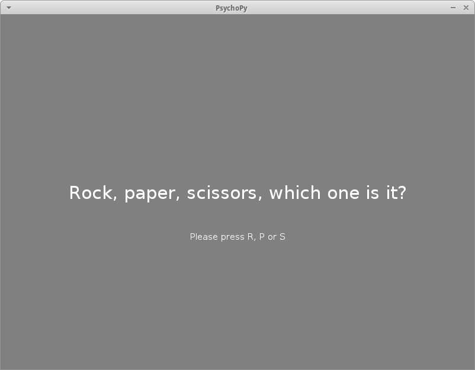
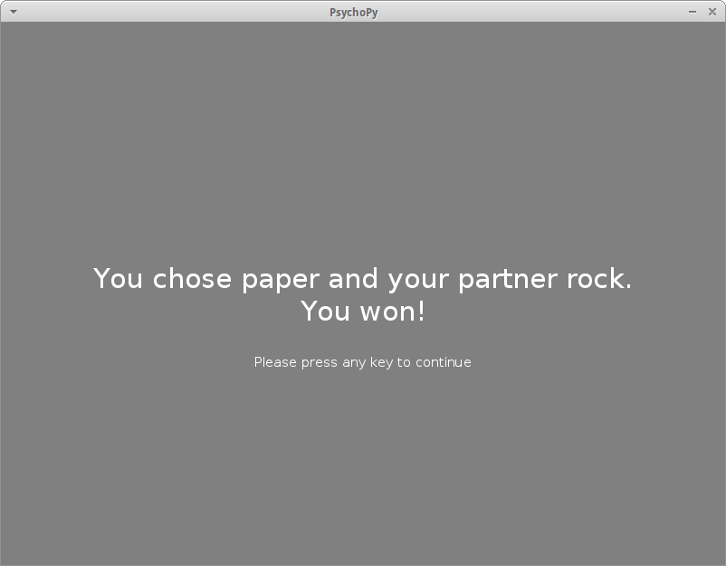
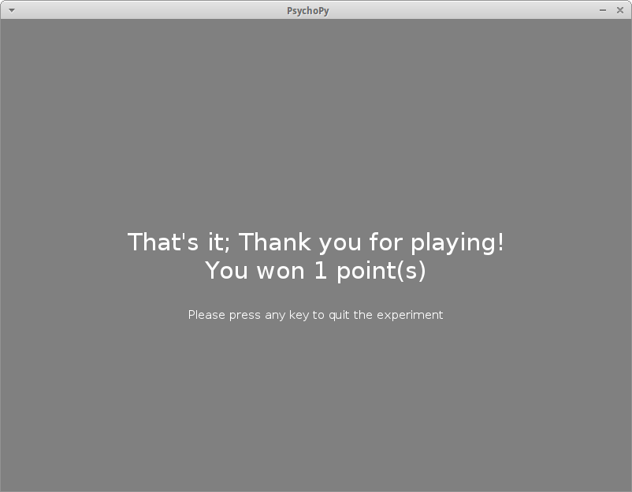

# PsychoPy example: Rock, paper, scissors

This directory contains a minimal (but complete) example of the use of the
psynteract package in combination with the excellent python-based experimental
toolkit [PsychoPy](http://www.psychopy.org/).

It implements the simplest interactive task we could think of -- a game of rock,
paper, scissors. However, it contains all the features one might require in a
vastly more complex task -- coding of choices and collection of overall points,
and logging local data to a csv file.

If you would like to use the example without [installing a local
server](https://github.com/psynteract/psynteract-docs/blob/master/installation.md),
please set the offline argument to `False` (where the
[connection](https://github.com/psynteract/psynteract-docs/blob/master/usage-connect.md)
is established, around line 35).

## Screenshots

## Versions

Last tested with PsychoPy 1.82.01.
